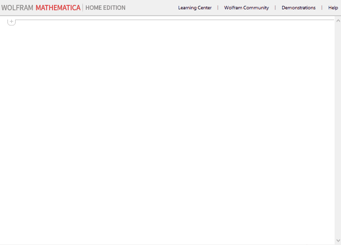

# MathematicaSSHKernels
Support for remote kernels built programmatically over SSH and dynamic remote port forwarding.

## Example Usage

```mathematica
In[1]:= Needs["SSHKernel`"]

In[2]:= rk = SSHKernel["raspberrypi"]; // AbsoluteTiming

Out[2]= {11.535, Null}

In[3]:= ParallelEvaluate[$Version, rk]

Out[3]= "11.2.0 for Linux ARM (32-bit) (January 15, 2018)"

In[4]:= $Version

Out[4]= "11.3.0 for Microsoft Windows (64-bit) (March 7, 2018)"
```

